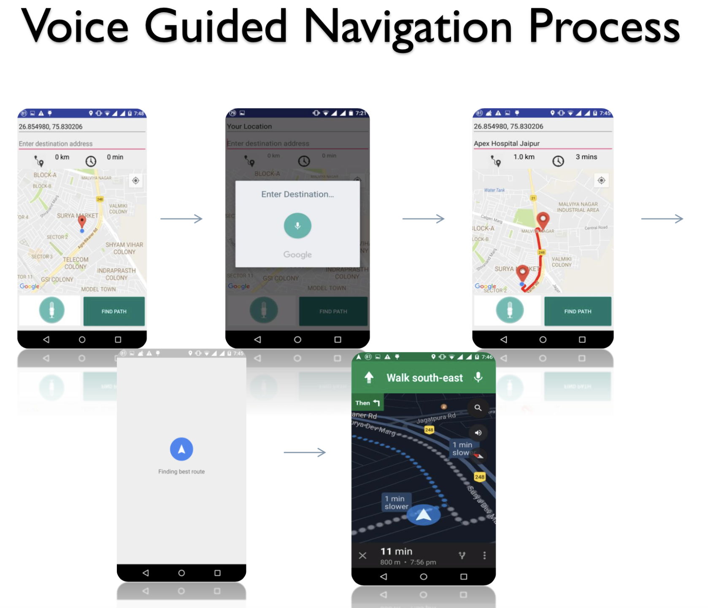
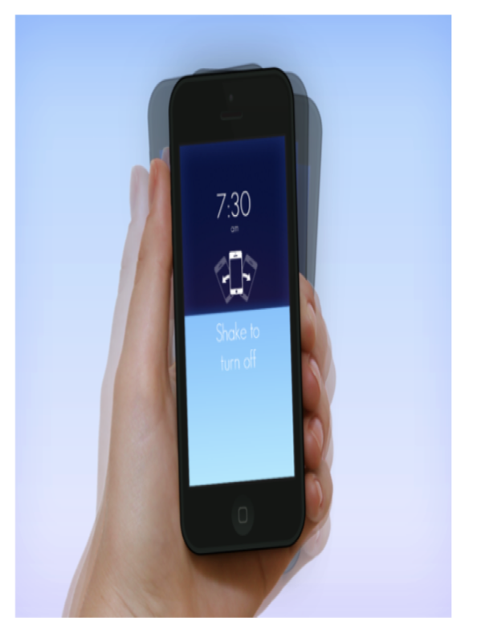
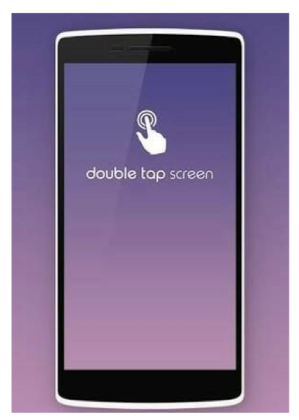
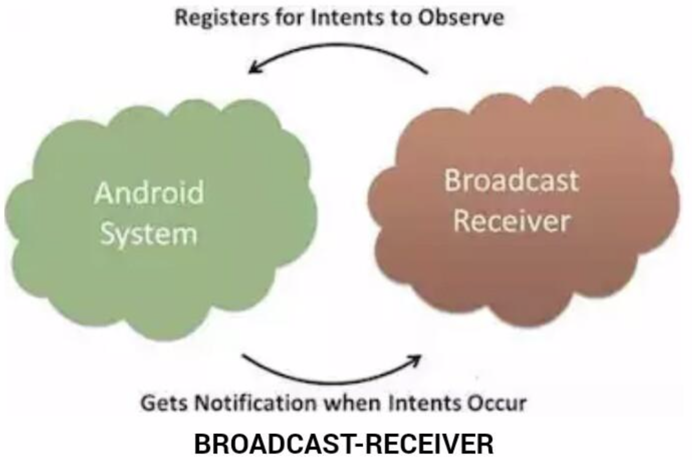
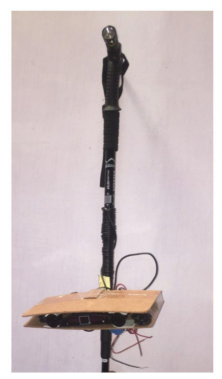
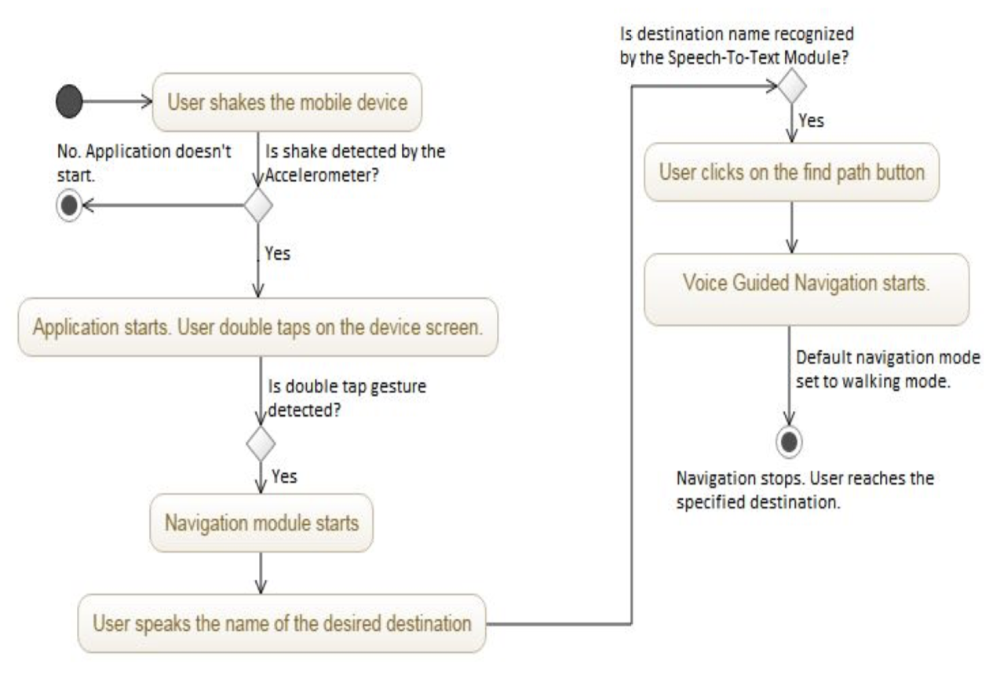
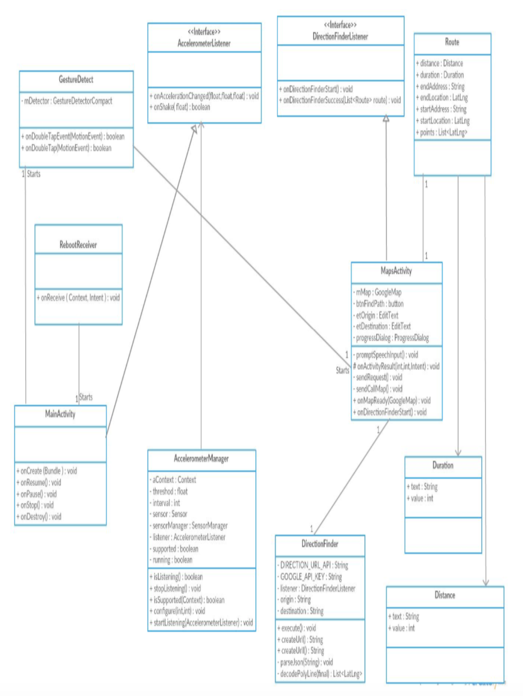

# Voice_Guided_Navigation (Android application)

This project is aimed at locating nearby places such as hospitals, medical stores,
departmental stores, bus stops, etc. for the user. The project focuses on
blind people providing an easy to access user interface allowing its user to directly operate
the application. The key feature of this project is development of a voice operated
navigation  system easily accessible to visually impaired people.
The project is based on the needs of unsighted ones while it can operated by other people
also. The project not only provides an easy to access UI for blind ones but a great way to
reach nearby places accurately. 

# Features:

Availability of nearest destination: This will enable the user to locate the nearest
store (destination) for which the user wishes for.

1. Tracing the shortest and feasible path to destination: This will enable the user to
know the shortest path available to the destination where he/she wants to reach.

2. Navigating till the destination: The voice guided navigation system will facilitate
the end user to navigate to the desired place and will notify them on upcoming turns,
circles, etc. with a precise distance.

3. Voice Input: This feature will enable blind people to provide desired destination by
the voice guided input.

4. Smart app gestures: This feature will enable the user to launch the app through
some gestures (like wave, sliding up, double tap) on home screen itself.

This android application runs on modern smart phones that are compatible
with android Lollipop (API level 22) or lower.

For more detailed information refer to Poster.pdf and Overview.pdf 

# Overview

For more detailed information refer to Poster.pdf and Overview.pdf 

All the source code files are available in the directory:

Voice_Guided_Navigation/app/src/main/java/com/example/shivam_gaur/voice_guided_navigation/

# Implementation details

The application consists of the following three modules:

# 1. Navigation module

This module will help user navigation from source till destination. This module comprises of
Google Maps API, Text box button and Distance Calculator and Total Duration
Calculator.
This activity consists of 2 fragments: One for Map and other for rest design elements.
Voice Controlled Navigation Algorithm
1. After the application is launched, the user’s current location is detected.
2. Through voice input, user specifies the desired destination.
3. User specifies the desired destination and long press the ‘Find Path’ button to start
navigation.
4. Google Speech-to-Text feature comprehends the user’s instruction and locates the
nearest desired destination.
5. Google Talk Back then informs the user whether the nearest destination is found or
not. If found then it helps the user in navigating to the destination by specifying
directions at each point.
6. A* algorithm used by Google API finds the nearest possible desired destination for the user.

# 2. Gesture Module

The module allows the user to open the application by simply double tapping on the home
screen of the device once the device shake has been detected.

How it works?
1. Once the application is installed in the android device, the device requires a
reboot.
2. Once the reboot completes, the application starts listening to gesture events made by the user and the accelerometer starts listening to the shake event.
3. Once the device is shaken, a notification is generated alerting the user to tap on the screen in order to open the app.

4. When the user taps twice on the screen, the double tap gesture is recognised and a
response is generated. The response is in the form of the execution of the app with the main activity being displayed on
the screen to start navigation.

This whole process of generating of a response when the screen is tapped twice after motion
detection after the device reboot consists of the following three steps:
1. Generation of broadcast message by the system on reboot after device shake.
2. A notification to alert the user.
3. Gesture detection

## 2.1. Broadcast message generation on reboot

Accelerometer- An accelerometer is a sensor which measures the tilting motion and
orientation of a mobile phone.

The Apple iPhone was the first popular mobile phone to make the accelerometer a key
feature of its user interface. Our application uses the accelerometer to detect device
motion which in turn makes the device ready to receive a double tap event for stating the
application.

Broadcast Receiver- A broadcast receiver is an android component that simply responds to
broadcast messages from other applications or from the system itself. These messages
are also called intents.

When the reboot process completes, an intent is generated which is responded to by the
registered broadcast receiver. The following broadcast receivers are used in this module:
"android.intent.action.BOOT_COMPLETED“
"android.intent.action.QUICKBOOT_POWERON"

There are two important steps to make Broadcast Receiver work for the system broadcast
intents:

Creating Broadcast receiver: This is implemented as a subclass of BroadcastReceiver
class overriding the onReceive() method where each object is received as an
Intent object parameter.

Registering Broadcast Receiver: An application listens for specific broadcast intents by
registering a broadcast receiver in AndroidManifest.xml file.

## 2.2. A notification to alert the user

Once the application is ready to be opened after the reboot, a notification is generated to let
him/her know that he/she can now double tap on the screen to open the app.

A notification appears as an icon in the notification area. To create the notification,

NotificationManager class is used which can be received from the context like an activity
via the getSystemService() method.
The code is written in MainActivity.java.

## 2.3. Gesture Detection

The code is written in GestureDetect.java file which extends the Activity class and
implements the following interfaces:
1. GestureDetector.OnGestureListener
2. GestureDetector.OnDoubleTapListener

# 3. Smart Stick with sensor

The smart stick is the blind stick used by visually impaired people. The stick is equipped with
a sensor and a buzzer and alerts the user whenever he/she approaches the obstacle.
The hardware consists of
1. Blind stick
2. IR Infrared proximity / obstacle detector sensor module with HIGH / LOW output mode
selection.
3. RMG 12075dc5v 30mA Active Electromagnetic Buzzers
4. HC-SR04 ultrasonic module distance measuring transducer sensor, uses sonar to
determine distance to an object.

Method: Supply module with 5V, the output will be 5V while obstacle in range, or 0V if not.
The out pin of this module is used as a switching output when anti-theft module, and
without the feet when ranging modules.

# 4. Speech-To-Text Module

This helps the user to enter value of destination through his own voice. This Module
comprises of Google speech to Text API which works on deep learning method
called Long short-term memory (LSTM) , recurrent neural network. LSTM RNNs avoid
the vanishing gradient problem and can learn "Very Deep Learning" tasks that require
memories of events that happened thousands of discrete time steps ago, which is
important for speech.

# 5. Directional APIs

This module will navigate user from source till destination along with shortest possible path.
These API will provide turn by turn voice output to its user.

# 6. Activity Diagram

# 7. Class Diagram

# 8. Dependencies

1. Requires latest version of Android Studio to generate apk.
2. JDK 8 or above required.

